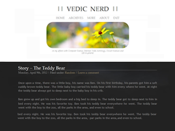

Vedic Nerd 1.1
==============

A modified version of [Manifest](https://theme.wordpress.com/themes/manifest/) (a minimalistic Wordpress theme)

Screenshot
----------

**Note: It's not responsive. So it probably won't look good on mobile devices.**

(I know it sucks. But you can check out [this link](https://github.com/PotHix/manifest-wordpress-theme-responsive) if it helps. And [here's the github link](https://github.com/jbarraud/Manifest) of the original Manifest theme)

License
-------

   Copyright 2013 Ganesh Mohan

   Licensed under the Apache License, Version 2.0 (the "License");
   you may not use this file except in compliance with the License.
   You may obtain a copy of the License at

       http://www.apache.org/licenses/LICENSE-2.0

   Unless required by applicable law or agreed to in writing, software
   distributed under the License is distributed on an "AS IS" BASIS,
   WITHOUT WARRANTIES OR CONDITIONS OF ANY KIND, either express or implied.
   See the License for the specific language governing permissions and
   limitations under the License.